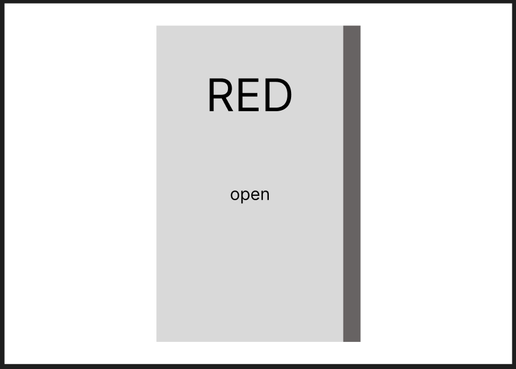
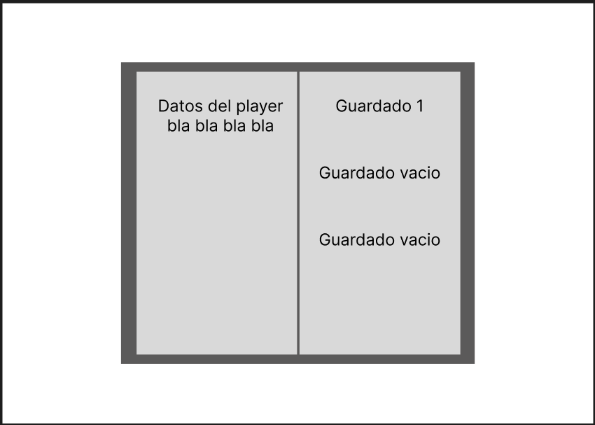
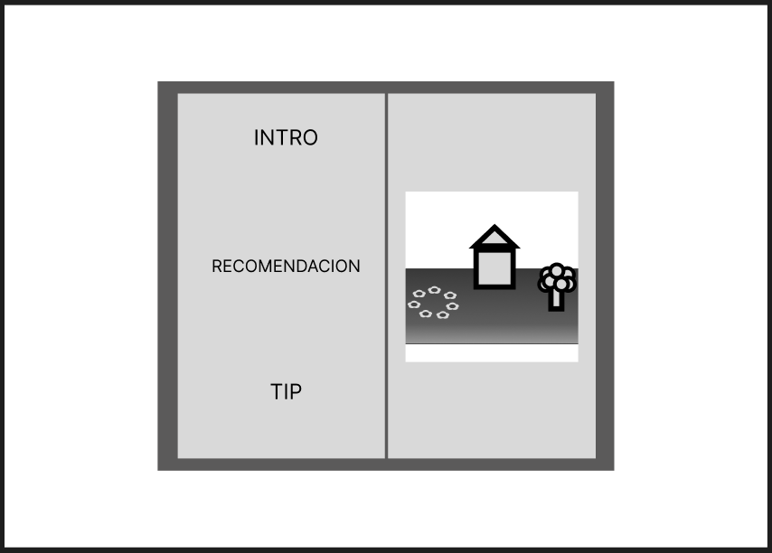

# Hub / Menú de Inicio – Diseño UI Narrativo

El **Hub principal** del juego se presenta como un **libro físico**, reforzando la idea de cuentos, memoria y progresión narrativa. Este libro no es solo un menú, sino un elemento diegético que acompaña al jugador desde el inicio.

---

## Estado Inicial: Libro Cerrado o Pantalla Principal

Al iniciar el juego, el jugador se encuentra con un **libro cerrado**, visto de frente, ocupando la mayor parte de la pantalla.

- El libro representa el acceso al mundo del juego.
- Su diseño es sobrio y minimalista, reforzando un tono misterioso.
- El lomo del libro es visible, indicando que contiene múltiples historias o capítulos.
- La única acción disponible es **abrir el libro**.
---

---

## Transición: Apertura del Libro / Pantalla Progreso Jugador

Al interactuar, el libro se **abre mediante una animación**, revelando una vista tipo doble página.

- La pantalla se divide claramente en **dos páginas**, imitando un libro real.
- El marco del libro permanece visible en todo momento para mantener coherencia visual.
- A partir de aquí, el libro se convierte en el **Hub central** del juego.

---

### Página Izquierda: Información del Jugador

La **página izquierda** está dedicada al estado del jugador.

Contenido mostrado:
- Datos generales del jugador (nombre, progreso, estadísticas relevantes).
- Información narrativa contextual (quién es el jugador dentro del mundo).
- Espacio reservado para ampliar datos conforme avanza la historia.

Esta página actúa como un **resumen de identidad y progreso**.

---

### Página Derecha: Partidas Guardadas

La **página derecha** contiene el sistema de guardado.

- Se muestran múltiples espacios de guardado.
- Cada slot puede estar en uno de dos estados:
  - **Guardado activo**: muestra información básica de la partida.
  - **Guardado vacío**: indica un espacio disponible para comenzar una nueva historia.
- El diseño es limpio y jerárquico, priorizando la legibilidad.

Desde esta página el jugador decide **continuar**, **crear** o **reiniciar** su experiencia.
---

---

## Sección de Intro y Guía (Pantalla de Carga)

Al avanzar o seleccionar ciertos elementos del libro, se accede a una sección introductoria.

Esta sección incluye:
- **Intro**: presentación del mundo y sus reglas.
- **Recomendaciones**: indicaciones narrativas o de gameplay.
- **Tips**: consejos breves integrados visualmente como anotaciones dentro del libro.
